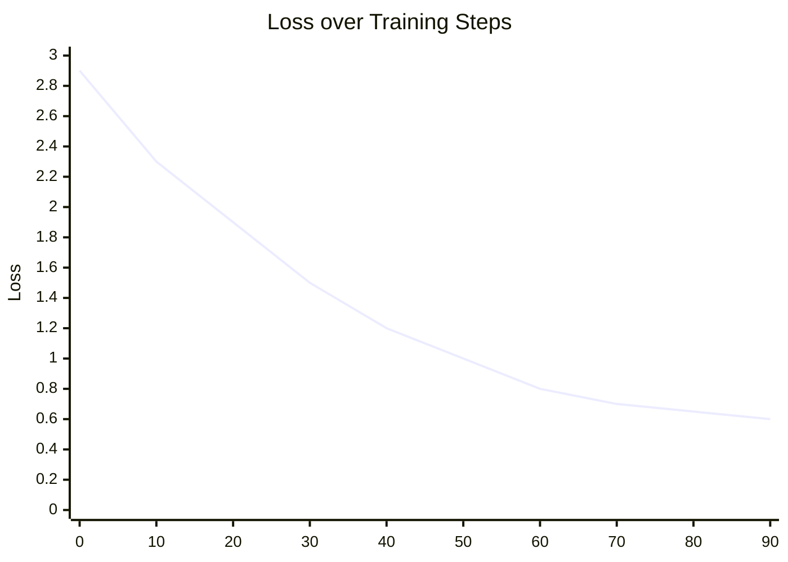
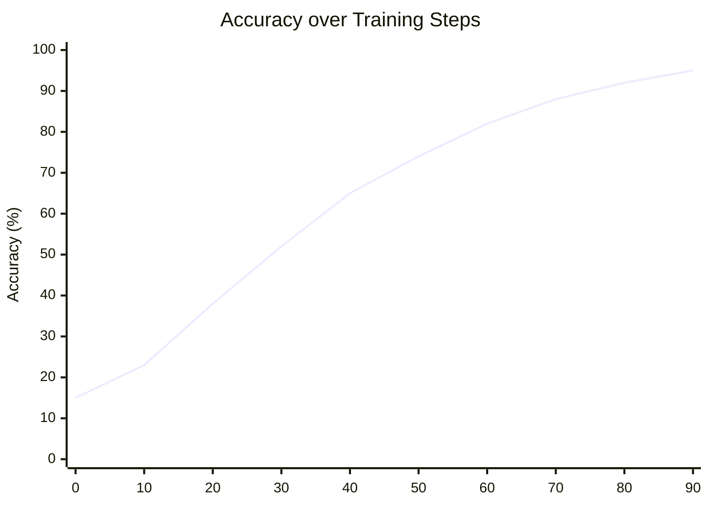

# Fine-tune Google Gemma with a Custom Dataset

This project demonstrates how to fine-tune the Google Gemma language model using LoRA (Low-Rank Adaptation) on a custom text dataset. The notebook loads a pre-trained Gemma model, applies 4-bit quantization for efficient memory usage, and trains it on a small instruction-style dataset for text generation.

The example uses the Hugging Face `Abirate/english_quotes` dataset and fine-tunes the model to generate quote/author-style outputs.

## Project Overview

- Base model: `google/gemma-2b`
- Quantization: 4-bit with BitsAndBytes
- PEFT method: LoRA
- Training framework: Hugging Face `transformers`, `trl`, `peft`, `datasets`
- Target task: causal language modeling / quote generation

## Repository Contents

- `Fine_tuning_gemma.ipynb` — main notebook with the complete training workflow
- `README.md` — project documentation

## Requirements

To run this project, you need:

- Python 3.10+
- A Hugging Face account
- A valid Hugging Face access token
- A CUDA-enabled GPU environment (recommended for Colab or a local NVIDIA GPU)
- Internet access to download the model and dataset

## Setup

### 1. Create a Hugging Face token

- Log in to Hugging Face
- Generate an access token from your account settings
- Save it securely as `HF_TOKEN`

### 2. Install dependencies

The notebook installs the required libraries:

```python
!pip install -q -U bitsandbytes
!pip install -q -U peft
!pip install -q -U trl
!pip install -q -U accelerate
!pip install -q -U datasets
!pip install -q -U transformers
```

### 3. Authenticate with Hugging Face

```python
import os
from google.colab import userdata
os.environ["HF_TOKEN"] = userdata.get('HF_TOKEN')

from huggingface_hub import login
login(os.environ["HF_TOKEN"])
```

## Model Loading

The notebook loads the Gemma model with 4-bit quantization using BitsAndBytes:

```python
model_id = "google/gemma-2b"

bnb_config = BitsAndBytesConfig(
    load_in_4bit=True,
    bnb_4bit_quant_type="nf4",
    bnb_4bit_compute_dtype=torch.bfloat16,
)

tokenizer = AutoTokenizer.from_pretrained(model_id, token=os.environ['HF_TOKEN'])
model = AutoModelForCausalLM.from_pretrained(
    model_id,
    quantization_config=bnb_config,
    device_map={"": 0},
    token=os.environ['HF_TOKEN']
)
```

This helps reduce memory usage while keeping the model usable for fine-tuning.

## Dataset

The project uses the Hugging Face dataset:

```python
from datasets import load_dataset

data = load_dataset("Abirate/english_quotes")
```

The dataset contains quote text and corresponding author names. The notebook formats the data into a simple prompt style like:

```text
Quote: <quote>
Author: <author>
```

## LoRA Fine-Tuning

The model is trained with LoRA using a small adapter configuration:

```python
lora_config = LoraConfig(
    r=8,
    target_modules=["q_proj", "o_proj", "k_proj", "v_proj",
                    "gate_proj", "up_proj", "down_proj"],
    task_type="CAUSAL_LM",
)
```

The trainer is created with `SFTTrainer` and `TrainingArguments`:

```python
trainer = SFTTrainer(
    model=model,
    train_dataset=data["train"],
    args=transformers.TrainingArguments(
        per_device_train_batch_size=1,
        gradient_accumulation_steps=4,
        warmup_steps=2,
        max_steps=100,
        learning_rate=2e-4,
        fp16=True,
        logging_steps=1,
        output_dir="outputs",
        optim="paged_adamw_8bit"
    ),
    peft_config=lora_config,
    formatting_func=formatting_func,
)
```

Then training begins with:

```python
trainer.train()
```

## Inference

After training, the model can generate new quote-style outputs from a prompt such as:

```python
text = "Quote: A woman is like a tea bag;"
inputs = tokenizer(text, return_tensors="pt").to(device)
outputs = model.generate(**inputs, max_new_tokens=50)
print(tokenizer.decode(outputs[0], skip_special_tokens=True))
```

## Training Metrics

The following charts are representative examples of the expected training behavior during fine-tuning. They illustrate how the loss typically decreases while model accuracy improves over training steps.





## Notes

- This project is designed for experimentation and learning.
- For production-quality fine-tuning, consider a larger dataset, more epochs, and stronger validation.
- The notebook is optimized for Google Colab but can be adapted to other GPU environments.
- You may need to adjust batch size, training steps, and sequence length depending on your GPU memory.

## Recommended Usage

1. Open the notebook in Colab.
2. Add your Hugging Face token.
3. Run the installation cells.
4. Load the Gemma model and dataset.
5. Train with LoRA.
6. Test generation quality with sample prompts.

## License

This project is provided for educational and research purposes. Please check model and dataset licenses before using in production or public workflows.
